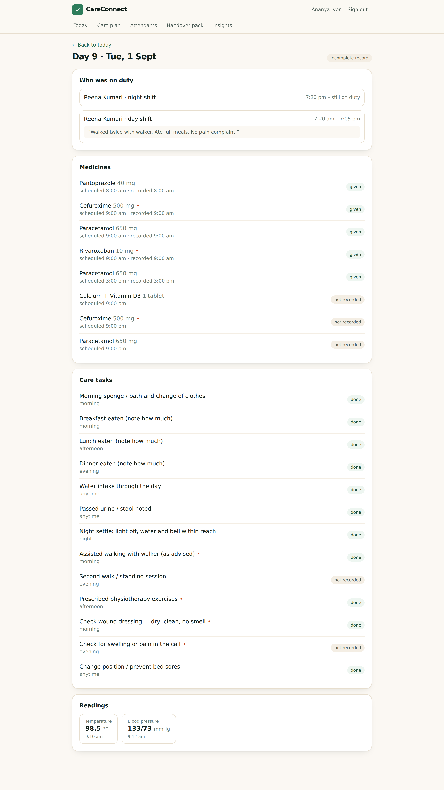
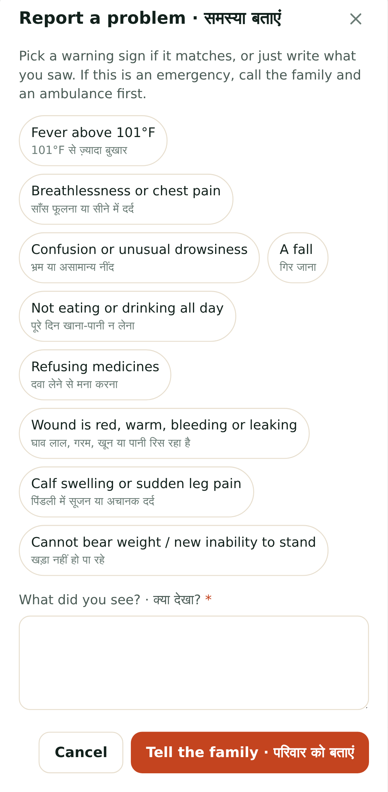
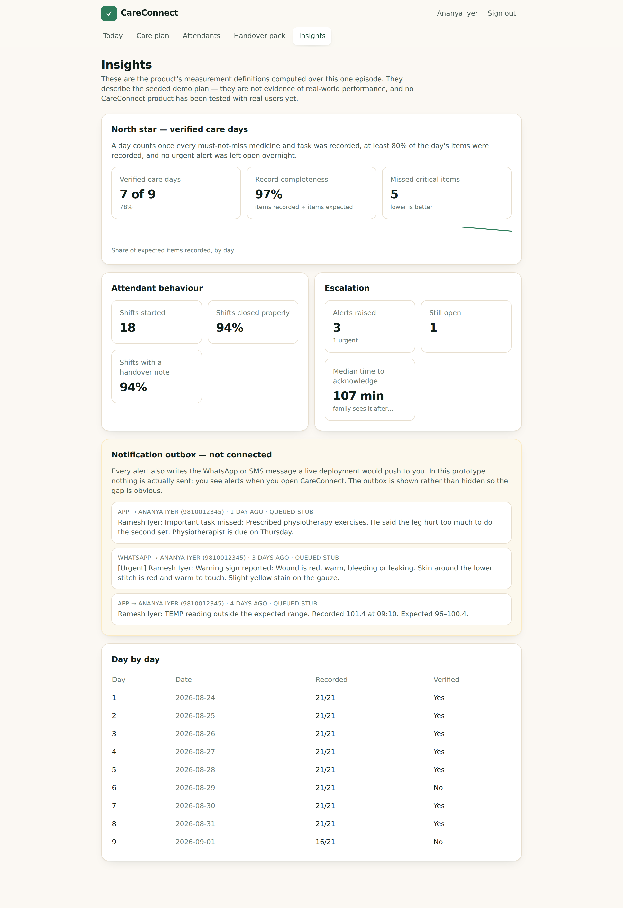

<div align="center">

# CareConnect

**The care record that stays with the patient, not the agency.**

A post-discharge care accountability layer for Indian families supervising a home
attendant from another city.

`React 19` · `TypeScript` · `Express 5` · `SQLite` · `Tailwind` · `Vitest` · `Playwright`

**60 unit & integration tests · 24 end-to-end journeys · 0 console errors**

</div>

---

> **The project started as a caregiver booking marketplace. The research rejected that
> premise, and this repository documents the reversal as carefully as the build.**
> Full reasoning: [`docs/15-decision-log.md`](docs/15-decision-log.md) (D-01).

---

## 1 · What is CareConnect?

A web app that turns the first 30 days after a hospital discharge into a verifiable record.

The family builds a care plan from their discharge summary. The attendant they already
hired — from an agency or otherwise — records each shift on their own phone in under five
minutes, in Hindi and English. Anything outside the plan raises an alert the family must
close with a note. When the attendant is replaced, a handover pack carries the plan, the
week and every decision already made to whoever comes next.

**CareConnect supplies no caregivers.** That is a strategy, not a gap — see §10.

## 2 · Who is it for?

**Ananya, 41.** Works in Bengaluru; her 74-year-old father was discharged in Delhi after a
hip replacement. She is paying ₹35,000–50,000 a month for a live-in attendant she met once,
over video.

Not the elder (not a user), not the agency (conflicted), not the hospital (a different
sale).

## 3 · What problem does it solve?

> A family can hire a home attendant within a day, but has no way to verify that the day's
> care actually happened, no early warning when it did not, and nothing that survives the
> attendant being replaced — which, in a workforce that rotates constantly, is the normal
> case rather than the exception.

## 4 · Why does it matter?

- India's 60+ population is heading for **~230 million by 2036**; the 80+ group grows
  **279% between 2022 and 2050**. <sup>S1, S2</sup>
- **70%** of elderly Indians depend on family for daily maintenance; **78%** have no
  pension — so the payer is an adult child, increasingly in another city. <sup>S5</sup>
- Home healthcare is a **USD 6.4bn** market growing at **12.9%**, *"highly fragmented"*,
  largely served by small local agencies and informal caregivers, with **no dedicated
  national regulatory framework**. <sup>S4</sup>
- **33.7%** of urban Indian older adults are on polypharmacy and **28.8%** on at least one
  potentially inappropriate medication — and medication reconciliation is the named
  first-week failure point after discharge. <sup>S6, S19</sup>

## 5 · Key research findings

| # | Finding | Consequence |
| --- | --- | --- |
| 1 | **Discovery is not scarce.** One provider advertises 2,000+ caregivers in 10 cities with a 3-hour allocation promise; no source describes a family unable to find someone | The marketplace brief was rejected |
| 2 | **Continuity is the base case.** Rotation without handover; switching agency means care *"effectively resets to Day 1"* | Continuity became the differentiator |
| 3 | **Nobody produces an artefact that survives the caregiver changing** | The handover pack became a P0 feature |
| 4 | **Every funded attempt failed on operations, not demand** — Portea ~USD 93m burned, Papa (USD 242m) shut, Elcare closed in 2024 <sup>C-grade</sup> | Own no supply |
| 5 | **The data source doesn't pay.** The family buys; the attendant supplies every byte | The attendant is the primary design user |

All sources are graded A–D in [`docs/00-evidence-index.md`](docs/00-evidence-index.md).
Provider marketing is never quoted as a statistic.

## 6 · Product hypothesis

> **If** a family sets up a shift-level care plan at discharge and their attendant can
> record it in under five minutes a shift, **then** the family will experience the record
> and its exception alerts as worth paying for, **because** the alternative is asking a
> parent who under-reports and an attendant whose word cannot be checked.

**Not yet validated.** See [`docs/14-experiment-plan.md`](docs/14-experiment-plan.md).

## 7 · The MVP

**P0 — the value proposition fails without these**

- Care plan from a discharge-type template — medicines with must-not-miss flags, a task
  routine by shift, readings with normal bands, warning signs (all bilingual)
- Attendant invite by 6-character code, no app install
- The shift model — start, record, close with a handover note
- Logging with a **mandatory reason** for anything not done
- Deterministic alerts: red flags, out-of-range readings, unrecorded critical doses, shifts
  not started, shifts closed incomplete
- Acknowledge → **close with a required note**
- The family's daily record and 7-day verified-day strip
- **The handover pack**, generated on every attendant change
- Roles and per-plan access control

**Cut on the removal test:** photo evidence, multiple family members, medicine stock,
attendant ratings, and — permanently — in-app chat. Reasons in
[`docs/09-prd.md`](docs/09-prd.md).

## 8 · Screenshots

| Family · today | Family · one day in full |
| --- | --- |
|  |  |

| Attendant · the whole app | Attendant · reporting a problem |
| --- | --- |
|  |  |

| The handover pack | Insights (measurement definitions) |
| --- | --- |
|  |  |

More in [`docs/screenshots/`](docs/screenshots).

## 9 · Architecture

```
React 19 + Vite + TS + Tailwind        Express 5 + TS
role-split UI                  ──►     routes: auth · plans · care · family
 /plans…  family                JSON   services: record · alerts · events
 /duty    attendant             cookie             │
                                                   ▼
                                        better-sqlite3 (one file, 16 tables)
        production: one process serving dist/client and /api
```

- Cookie sessions (HttpOnly, SameSite=Lax, bcrypt, JWT), role checks on every plan route
- Zod validation at every boundary; parameterised SQL throughout
- Nothing is ever deleted — stopping a medicine deactivates it; ending an attendant ends a
  membership; any past day can be read as it stood
- A deterministic alert engine (a readable table of thresholds, no model)
- First-party analytics in the same database; **no free text, names or readings ever
  recorded as events**

Detail: [`docs/16-technical-architecture.md`](docs/16-technical-architecture.md).

## 10 · Key product decisions

| # | Decision | Trade-off |
| --- | --- | --- |
| D-01 ↺ | **Reject the marketplace brief** | Gave up the larger, more obvious business |
| D-02 | **Own no supply, ever** | Cannot promise a replacement |
| D-03 | Beachhead = away adult child **∩** post-discharge | A smaller starting market |
| D-04 | Beat WhatsApp on day one or don't ship | Several good features cut |
| D-05 | The attendant is the primary writing user | The data source has no financial stake |
| D-07 | "Could not do it" with a mandatory reason | Slower to record a bad day |
| D-10 ↺ | Notification delivery stubbed **and visibly labelled** | The core promise is not delivered yet |
| D-16 | Stop building; go interview | The product stays visibly incomplete |

All sixteen, with alternatives and evidence:
[`docs/15-decision-log.md`](docs/15-decision-log.md).

## 11 · Metrics

**North Star — verified care days per active patient per week.** A day counts when every
must-not-miss item was recorded, ≥80% of the day was recorded, and no urgent alert was left
open.

**Guardrails, which matter more here than the growth metrics:** attendant time per shift
> 5 min · burst logging > 30% of shifts · false-alert rate > 20%. The real risk is not that
people ignore the product — it is that they use it dishonestly.

Definitions and targets: [`docs/13-metrics.md`](docs/13-metrics.md). **No number in this
repository is a result.**

## 12 · Current status

| | |
| --- | --- |
| Product | MVP complete against its acceptance criteria |
| Tests | 60 unit/integration + 24 end-to-end, all passing |
| Console errors | 0 across 10 captured screens |
| Real users | **None.** No interviews, no pilot, no revenue, no retention data |
| Next | Six weeks of experiments, no new engineering |

## 13 · Limitations

**Product**
- No user research has been conducted. Every usability claim is a designer's judgement.
- Two existential assumptions are unvalidated: attendants logging without supervision (H6)
  and families paying for reassurance unbundled from service (H5).
- One family member per plan; the episode ends at day 30 with no chronic-care mode.

**Technical**
- **WhatsApp/SMS delivery is not connected.** Every alert composes the message it would
  send into an outbox the app displays under a heading saying so.
- Time-based alert checks run lazily when a family member loads the plan, not on a
  scheduler — so a 2am alert waits for someone to open the app.
- No offline logging; a lost connection fails the request rather than queueing it.
- SQLite single-writer; no password reset; no OTP login; no CSP header; no encryption at
  rest; no audit log of who *read* a record.

**Compliance and ethics**
- Not DPDP-compliant: no versioned consent record, no data-subject export or erasure flow,
  no retention policy, no DPO or DPIA.
- **The patient does not consent.** They are the data subject and not a user. The MVP has
  no answer to this; a production version needs one.
- The app is not a medical device and gives no clinical advice. Both the family's and the
  attendant's screens say so.

## 14 · Future opportunities

1. **Reliability** — WhatsApp delivery, offline logging, a scheduler, a second family
   member, photos on red flags.
2. **Continuity as a business** — an agency view paid for by the family; a portable work
   record an attendant carries between families.
3. **The sequel** — a verified caregiver marketplace built on episode data that only exists
   because the accountability layer ran first (the original brief, earned rather than
   assumed).
4. **Distribution** — hospital discharge desks, physiotherapists, and eventually insurers
   for whom a documented recovery is a readmission-risk lever.

## 15 · How to run it locally

**Requires Node 20+.**

```bash
git clone <this repo> && cd careconnect
npm install
npm run seed            # a fictional 9-day episode with an attendant replacement
npm run dev             # API on :4000, web on http://localhost:5173
```

Open **http://localhost:5173** and use the demo buttons on the sign-in screen, or:

| Role | Mobile | Password | What you see |
| --- | --- | --- | --- |
| Family (Ananya, daughter in Bengaluru) | `9810012345` | `demo1234` | Day 9 of 30, an open alert, the week strip, the handover pack |
| Attendant (Reena, currently on duty) | `9810055555` | `demo1234` | The shift screen, mid-shift |

```bash
npm test                              # 60 unit + integration tests
CHROMIUM_PATH=$(which chromium) npm run test:e2e   # 24 journeys, mobile + desktop
npm run build && npm start            # production: one process on :4000
RESET=1 npm run seed                  # rebuild the demo data
```

> The seeded episode is **fictional**. No real patient data is included, and none should be
> entered — this is a portfolio prototype.

## 16 · Documentation map

| | |
| --- | --- |
| [00 · Evidence index](docs/00-evidence-index.md) | Every source, graded A–D |
| [01 · Problem discovery](docs/01-problem-discovery.md) | How the brief was rejected |
| [02 · Market research](docs/02-market-research.md) | Sizing, payers, the failure pattern |
| [03 · User research](docs/03-user-research.md) | Demand and supply side; what I could not learn |
| [04 · Competitive analysis](docs/04-competitive-analysis.md) | Three layers, three gaps, positioning |
| [05 · Personas](docs/05-personas.md) | Ananya, Reena, Ramesh, and the anti-personas |
| [06 · Jobs to be done](docs/06-jtbd.md) | Three jobs, and the ones deliberately unserved |
| [07 · Opportunity analysis](docs/07-opportunity-analysis.md) | Segment scoring, H1–H6 tested, 5 opportunities ranked |
| [08 · Product strategy](docs/08-product-strategy.md) | Positioning, principles, non-goals |
| [09 · PRD](docs/09-prd.md) | The removal test, requirements, acceptance criteria |
| [10 · User flows](docs/10-user-flows.md) | Five flows with edge and failure states |
| [11 · Information architecture](docs/11-information-architecture.md) | Routes, hierarchy, data model, naming |
| [12 · Design decisions](docs/12-design-decisions.md) | Palette, bilingual UI, accessibility |
| [13 · Metrics](docs/13-metrics.md) | North star, activation, quality, guardrails |
| [14 · Experiment plan](docs/14-experiment-plan.md) | Five experiments, six weeks, no engineering |
| [15 · Decision log](docs/15-decision-log.md) | 16 decisions, 7 reversals |
| [16 · Technical architecture](docs/16-technical-architecture.md) | Stack, API, security, DPDP posture |
| [17 · Testing](docs/17-testing.md) | Coverage, 10 defects found and fixed, self-critique |
| [18 · Learnings](docs/18-learnings.md) | What I got right and what I would redo |
| **[Portfolio case study](docs/portfolio-case-study.md)** | **The full narrative, start to finish** |
| [LinkedIn material](docs/linkedin-post.md) | Post and carousel outline |

---

<div align="center">

**No users. No revenue. No traction.** Everything unvalidated in this repository is labelled
as such — including the two assumptions the whole product rests on.

</div>
