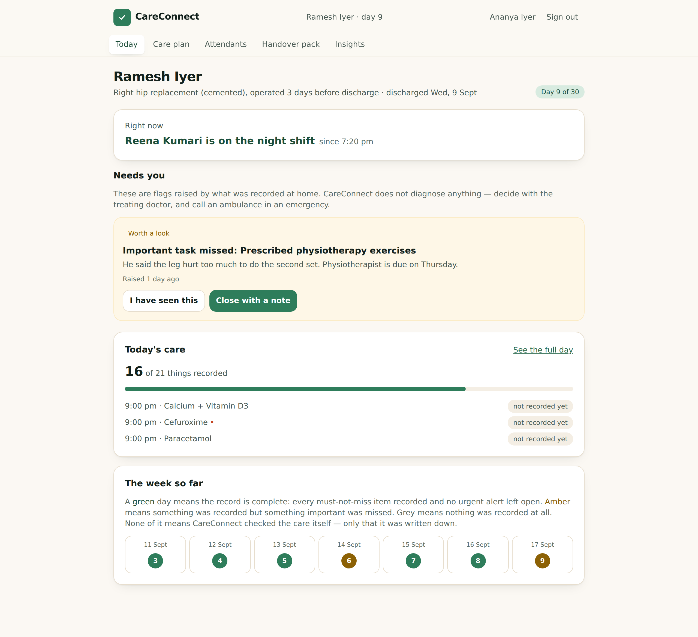
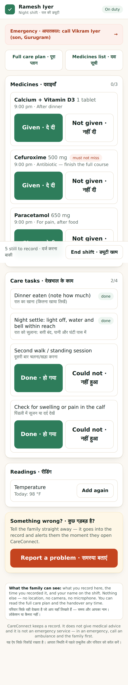
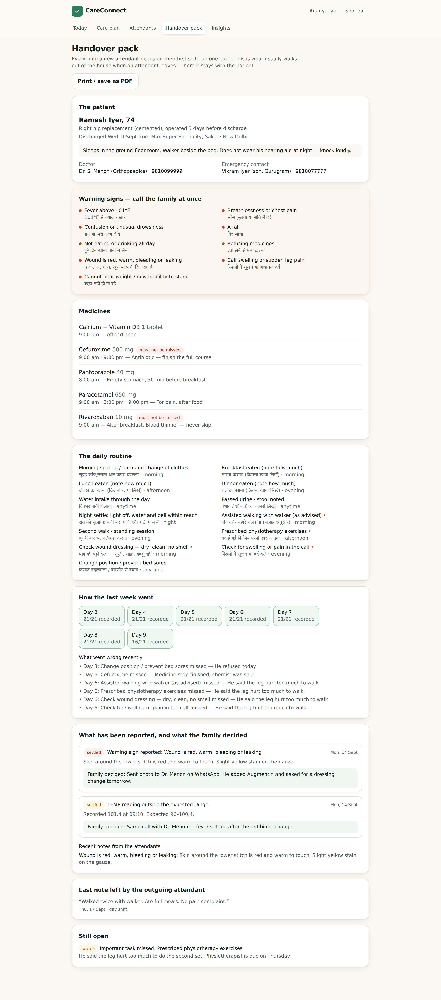
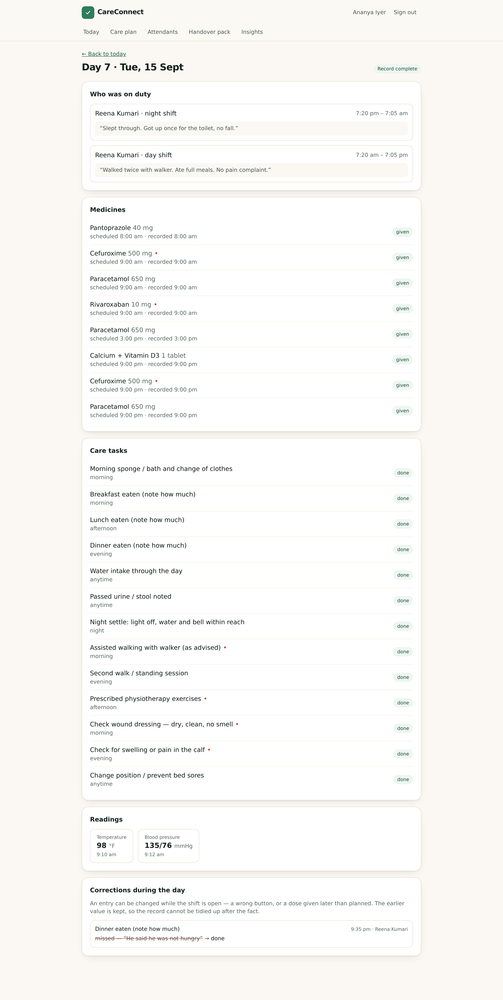

<div align="center">

# CareConnect

### A post-discharge care accountability layer for families managing care from another city.

Your parent comes home from hospital. Someone you met once over video is with them all day.
CareConnect is the record of what actually happened — kept by whoever is in the room, and it
survives them leaving.

**No users yet · Two hypotheses unvalidated · Nothing here claims traction**

`React 19` · `TypeScript` · `Express 5` · `SQLite` · `Tailwind` · `Vitest` · `Playwright`
· **121 automated checks** · **0 accessibility issues**

[Case study](docs/portfolio/portfolio-case-study.md) · [Decision log](docs/decisions/15-decision-log.md) ·
[What's validated](docs/validation/19-validation-plan.md) · [Run it locally](#run-it-locally)

</div>

---

> **This started as a caregiver booking marketplace. The research rejected that premise,
> and this repository documents the reversal as carefully as the build.**
> → [`docs/decisions/15-decision-log.md`](docs/decisions/15-decision-log.md), decision D-01.

---

## The problem

A family can hire a home attendant within a day. What they cannot buy is proof that the
day's care actually happened, an early warning when it did not, or anything that survives
the attendant being replaced — which, in a workforce that rotates by design, is the normal
case rather than the exception.

**Why it matters:** India's 60+ population is heading for ~230 million by 2036; 70% of
elderly Indians depend on family and 78% have no pension, so the payer is an adult child,
increasingly in another city. Home healthcare is a USD 6.4bn market with *no dedicated
national regulatory framework*. <sup>Sources graded A–D in
[docs/00](docs/research/00-evidence-index.md)</sup>

## The research insight

**Discovery is not the scarce thing.** One provider advertises 2,000+ caregivers across ten
cities with three-hour allocation; another publishes a 24-hour replacement promise. Agencies,
hospital desks and WhatsApp networks all produce someone within a day.

No source described a family unable to *find* an attendant. They described what happened
after — untrained staff, helpers who *"disappear without notice"*, and care that
*"effectively resets to Day 1"* when the agency rotates.

*(That is absence of evidence, not evidence of absence. The falsifier is written into
[docs/01](docs/research/01-problem-discovery.md): if 4 of 10 discharge interviews name finding an
attendant as the hardest problem, this reframing is wrong.)*

## The product

**CareConnect is the care record that stays with the patient, not the agency.** It supplies
no caregivers. It sits on top of whoever the family already hired.

## The core workflow

```
FAMILY, on discharge day                 ATTENDANT, every shift
─────────────────────────                ──────────────────────
 build the care plan from the             join with a 6-character code
 discharge summary (5 min)                (no app to install)
          │                                        │
 invite the attendant  ──── code ────────▶  start shift
          │                                        │
          │                              medicines · tasks · readings
          │                              "Could not do · नहीं हुआ" → reason required
          │                                        │
 alert ◀────── red flag · out-of-range reading · critical dose unrecorded
          │                                        │
 acknowledge → close WITH A NOTE           end shift + note for the next person
          │                                        │
          └──────────▶  HANDOVER PACK  ◀───────────┘
                   the plan, the week, the warning signs
                   and every decision already made —
                   generated on every attendant change
```

## Screenshots

| Family · today | Attendant · the whole app |
| --- | --- |
|  |  |

| The handover pack | Corrections are shown, never hidden |
| --- | --- |
|  |  |

More in [`docs/screenshots/`](docs/screenshots).

## Architecture

```
React 19 + Vite + TS + Tailwind        Express 5 + TypeScript
role-split UI                  ──►     routes: auth · plans · care · family
 /plans…  family                JSON   services: record · alerts · revisions · events
 /duty    attendant             cookie             │
                                                   ▼
                                        better-sqlite3 (one file, 17 tables)
        production: one process serving dist/client and /api
```

- Cookie sessions (HttpOnly, SameSite=Lax, bcrypt, JWT); role checks on every plan route
- Zod validation at every boundary; parameterised SQL throughout
- **Nothing is deleted and nothing is silently rewritten** — a care entry can be corrected
  during its shift, but the previous value, reason, time and author are appended to an
  immutable log and shown to the family
- A deterministic alert engine — a readable table of thresholds, no model
- First-party analytics; no free text, names or readings ever recorded as events

Detail: [`docs/engineering/16-technical-architecture.md`](docs/engineering/16-technical-architecture.md).

## Testing

| | |
| --- | --- |
| Unit + integration | **70** (`npm test`) |
| End-to-end — phone, tablet, desktop | **51** (`npm run test:e2e`) |
| Accessibility sweep, 7 pages | **0 issues** (`npm run audit:a11y`) |
| Console errors across 11 screens | **0** |

Twenty-two defects found and fixed across three iterations. Every workflow in the
definition of done has an end-to-end test behind it, including *a family cannot open
another family's case* and *a replacement attendant sees the previous handover*. The three
that changed the product: the handover pack silently lost resolved decisions; **care entries
could be rewritten with no trace**; and the north-star metric was pointed at the wrong risk.
[`docs/engineering/17-testing.md`](docs/engineering/17-testing.md).

## Key product decisions

| # | Decision | Trade-off |
| --- | --- | --- |
| D-01 ↺ | **Reject the marketplace brief** | Gave up the larger, more obvious business |
| D-02 | Own no supply, ever | Cannot promise a replacement |
| D-05 | The attendant is the primary writing user | The data source has no financial stake |
| D-07 | "Could not do it" with a mandatory reason | Slower to record a bad day |
| D-10 ↺ | Delivery stubbed **and shown in the product** | The core promise is not fully delivered |
| D-17 ↺ | **Care entries append-only; corrections shown** | One more table, one more section |
| D-18 ↺ | **"Verified" renamed to "documented"** | A weaker-sounding metric, and a truer one |
| D-22 ↺ | Downgraded three of my own conclusions | The story reads less punchy |
| D-23 ↺ | **Split the north star: documented vs complete days** | A low bar that looks unimpressive, and needs guardrails to stay honest |

All 25, with alternatives and evidence: [`docs/decisions/15-decision-log.md`](docs/decisions/15-decision-log.md).

## How success is measured

**North star — documented care days:** a day with at least one care record, entered by an
identified user. Deliberately a low bar: the first question is whether a shared record gets
kept at all. **Complete care days** — every must-not-miss item recorded, no urgent alert
left open — is tracked separately as the quality measure.

Neither says "verified". CareConnect cannot confirm a tablet was swallowed; it records what
one person entered, at a time, under their name, with corrections kept.

The guardrails matter more than either: attendant time over 5 minutes a shift, burst logging
over 30% of shifts, or a false-alert rate over 20% each stop the roadmap.
[`docs/metrics/13-metrics.md`](docs/metrics/13-metrics.md).

## Current validation status

| | |
| --- | --- |
| ✅ **Validated** | The core flows work; entries cannot be silently rewritten; the interface clears mechanical accessibility checks — *all engineering facts, none of them product validation* |
| ⏳ **NOT YET VALIDATED** | Attendants will log unsupervised · families will pay unbundled · the handover pack improves continuity · families prefer this to a WhatsApp group |
| 📋 **Ready to run** | Interview guides, pre-registered thresholds, a [pilot runbook](docs/validation/pilot-runbook.md), [participant materials](docs/validation/participant-materials.md) in English and Hindi, consent scripts and an [evidence table](docs/validation/evidence-table.md) — all written, none used |

## Limitations

- **No user research.** Every usability claim is a designer's judgement.
- **WhatsApp/SMS delivery is not connected.** Each alert composes the message it would send
  into an outbox the app displays under a heading saying so.
- **Time-based alerts run when a family member opens the app**, not on a scheduler — a 2am
  alert waits.
- No offline logging, one family member per plan, no password reset, no OTP login.
- Not DPDP-compliant: no versioned consent, no export or erasure flow, no retention policy.
- **The patient does not consent.** They are the data subject and not a user. The MVP has no
  answer to this.
- The app is not a medical device and gives no clinical advice. Both interfaces say so.

## Future opportunities

1. **Reliability** — WhatsApp delivery, a scheduler, offline logging, a second family member.
2. **Continuity as a business** — an agency view paid for by the family; a portable work
   record an attendant carries between families.
3. **The sequel** — a verified caregiver marketplace built on episode data that exists only
   because the accountability layer ran first. The original brief, earned rather than assumed.
4. **Distribution** — hospital discharge desks, physiotherapists, and employer elder-care
   benefits (the most under-explored payer, and the designated fallback if families won't pay).

## Run it locally

**Requires Node 20+.**

```bash
npm install
npm run seed        # a fictional 9-day episode with an attendant replacement
npm run dev         # API on :4000, web on http://localhost:5173
```

Open **http://localhost:5173** and use the demo buttons on the sign-in screen, or:

| Role | Mobile | Password | What you see |
| --- | --- | --- | --- |
| Family (Ananya, daughter in Bengaluru) | `9810012345` | `demo1234` | Day 9 of 30, an open alert, the week strip, the handover pack, a correction on day 7 |
| Attendant (Reena, currently on duty) | `9810055555` | `demo1234` | The shift screen, mid-shift |

```bash
npm test                                            # 65 unit + integration tests
CHROMIUM_PATH=$(which chromium) npm run test:e2e    # 30 journeys, mobile + desktop
CHROMIUM_PATH=$(which chromium) npm run audit:a11y  # accessibility sweep
npm run build && npm start                          # production: one process on :4000
RESET=1 npm run seed                                # rebuild the demo data
```

> The seeded episode is **fictional**. No real patient data is included, and none should be
> entered — this is a portfolio prototype.

## Documentation

Full index: **[`docs/README.md`](docs/README.md)** — grouped into `research/`, `product/`,
`decisions/`, `metrics/`, `validation/`, `engineering/` and `portfolio/`.

| | |
| --- | --- |
| **[Portfolio case study](docs/portfolio/portfolio-case-study.md)** | **The full narrative, start to finish** |
| [00 · Evidence index](docs/research/00-evidence-index.md) | Every source graded A–D, plus a claim register of the 13 load-bearing conclusions |
| [01 · Problem discovery](docs/research/01-problem-discovery.md) | How the brief was rejected, and the falsifier |
| [02 · Market research](docs/research/02-market-research.md) | Sizing, payers, and why the headline number misleads |
| [03 · User research](docs/research/03-user-research.md) | Demand and supply side; what I could not learn |
| [04 · Competitive analysis](docs/research/04-competitive-analysis.md) | Three layers, why each incumbent wins, positioning |
| [05 · Personas](docs/product/05-personas.md) · [06 · JTBD](docs/product/06-jtbd.md) | Ananya, Reena, and the jobs deliberately unserved |
| [07 · Opportunity analysis](docs/research/07-opportunity-analysis.md) | Segment scoring, H1–H6 tested, 5 opportunities ranked |
| [08 · Product strategy](docs/product/08-product-strategy.md) | Positioning, principles, non-goals, five candidate payers |
| [09 · PRD](docs/product/09-prd.md) | The removal test, requirements, acceptance criteria |
| [10 · User flows](docs/product/10-user-flows.md) · [11 · IA](docs/product/11-information-architecture.md) | Journeys with edge and failure states |
| [12 · Design decisions](docs/product/12-design-decisions.md) | Palette, bilingual UI, accessibility |
| [13 · Metrics](docs/metrics/13-metrics.md) | North star, guardrails, and why "verified" became "documented" |
| [14 · Experiment plan](docs/validation/14-experiment-plan.md) | Sequencing: six weeks, no engineering |
| [15 · Decision log](docs/decisions/15-decision-log.md) | 22 decisions, 11 reversals |
| [16 · Technical architecture](docs/engineering/16-technical-architecture.md) | Stack, API, security, DPDP posture |
| [17 · Testing](docs/engineering/17-testing.md) | Coverage, 17 defects, the accessibility sweep |
| [18 · Learnings](docs/portfolio/18-learnings.md) | Plus 15 skeptical-interviewer questions, answered |
| [19 · Validation plan](docs/validation/19-validation-plan.md) | Interview guides, observation protocol, consent, experiment tracker |
| [Portfolio review](docs/portfolio/portfolio-review.md) | Scored 1–10 as a hiring manager would |
| [LinkedIn post](docs/portfolio/linkedin-post.md) · [carousel](docs/portfolio/linkedin-carousel.md) | Ready to publish |

---

<div align="center">

**No users. No revenue. No traction.** Everything unvalidated is labelled as such —
including the two assumptions the whole product rests on.

</div>
